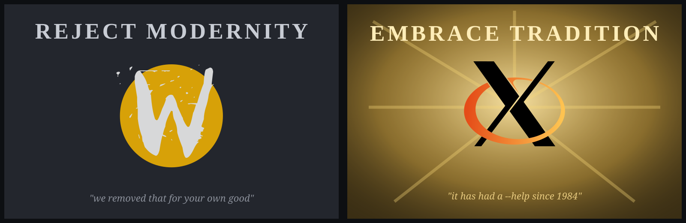

# w11

**X11 was the X that stuck. w11 is the Wayland that behaves like it.**

The X11 power tools, `xdotool`, `wmctrl`, `xprop` and `xrandr`, reborn as no-bullshit
drop-in clones that work on Wayland. Same commands, same flags, same output bytes,
same scripts, bugs faithfully included. Symlink them over the originals and your
muscle memory never finds out the compositor changed underneath it.

<p align="center">

</p>

In the box:

- **wdotool**, xdotool, all 48 commands, byte-parity
- **wwmctl**, wmctrl, for native Wayland *and* legacy X apps in one list
- **wxprop**, xprop, real X properties for XWayland windows and synthesized ones for native windows
- **wxrandr**, xrandr, with first-class multimonitor: reshape crazy layouts in one atomic call
- **warandr**, arandr, the drag-your-monitors GUI, on Wayland (via wxrandr) and X11 (via xrandr)
- **wmirror**, the one that clones nothing: mirror a *region*, or an odd-shaped output, on wlroots
- **xw11**, the other direction entirely: an X11 display in front of the session's X server, so the
  *original* xdotool, wmctrl, xprop, xrandr and every other X client answer about the whole desktop

## Motivation

Yes, this is far too much code for something that just types into a window. Have a
look at what it is up against.

- https://www.semicomplete.com/blog/xdotool-and-exploring-wayland-fragmentation/
- https://daniele.tech/2025/04/how-to-center-the-mouse-between-monitors-in-wayland/
- https://thelastguardian.me/posts/2026-04-26-screen-control-on-wayland/
- https://discuss.kde.org/t/questions-about-ui-automation-on-kwin-wayland/1778
- https://discuss.kde.org/t/move-mouse-to-screen/28971

## Philosophy

One rule decides what goes in here, and it is written down in
[AGENTS.md](AGENTS.md): **if X supports it, we support it.** What Wayland forbids is
a cost to be paid, never a reason. Where a compositor will not do a thing the X
tools did, that is a gap in this tree with a route beside it, not a policy, and the
[per-tool tables](docs/WDOTOOL.md#what-differs-from-x-on-kde-plasma) say which.

## Install

On a default Ubuntu 24.04 or 26.04 desktop, one file and one command. The built
package is in the clone, at
[`release/w11_0.4.0_all.deb`](release/w11_0.4.0_all.deb), and on the
[releases page](https://github.com/zardus/w11/releases). From the
top of a clone:

```sh
sudo apt install ./release/w11_0.4.0_all.deb
```

`sh scripts/build-deb.sh` rebuilds that same file in place from the source beside it.

That is the six tools in `/usr/bin` — seven commands, counting
[`xw11`](docs/XW11.md), the X11 proxy the four wrappers start for themselves — the
GNOME Shell bridge extension where
`gnome-shell` looks for it, the udev rule that opens `/dev/uinput` to whoever is at
the seat, the `warandr` menu entry, and one thing that is put there and left switched
off, the [overlap extension](#overlapping-monitors-on-gnome). **One**
`Architecture: all` package for **both** releases, because every module here is pure
standard library and your own `python3` byte compiles it at install time. The real `xdotool`, `wmctrl`, `xprop` and
`xrandr` stay exactly as they were, so a script that calls both keeps working, and
`sudo apt remove w11` takes every piece away again. The package **Recommends** `xdotool`,
`wmctrl`, `x11-utils` and `x11-xserver-utils`, which apt installs by default: with them
present the tools you already know are what runs, on Wayland as on X11, through
[`xw11`](docs/XW11.md) — and `W11_PROXY=never` asks for the clones instead.

**On GNOME, log out and back in once.** That is the whole of the manual procedure.
`gnome-shell` reads extension directories only when a session starts, so until you do
that the window commands say the bridge is not running. The package enables the
extension for you inside that first session. Everything else works the moment apt
finishes: the display commands, the GUI, typing and clicking.

Then [check it worked](#check-it-worked). If the package is not what you want, the
other routes are [a clone with pip](#from-a-clone-with-pip), which is the normal one
for development, and [pipx, the user site, one venv for the whole machine, the
single-file builds and nix](#other-ways-to-install). What the package puts where, and
why the extension and the rule are handled the way they are, is
[debian/README.Debian](debian/README.Debian) and
[docs/Technical.md § 11](docs/Technical.md#11-installing-what-each-route-costs).


*The whole of it on a default Ubuntu 26.04 desktop, in real time: one `apt` command
(the package copied to the home directory first, so the path typed there is shorter
than the one above), the package explaining the one manual step, and the six tools
answering `--version`.*

### What your desktop needs

Whichever route you took, your desktop wants a piece of its own, and on all but one of
them that piece is nothing.

#### GNOME

Stock GNOME Wayland sessions, Ubuntu 24.04 (GNOME 46) and 26.04 (GNOME 50) as
installed, need one extra thing: GNOME has no window management protocol, so the
window side goes through a small GNOME Shell extension that exports Mutter over the
session bus. The [.deb](#install) brings it. From a clone, run the installer
yourself, because pip does not install it:

```sh
sh gnome/install-bridge.sh          # copies the extension, enables it
sh gnome/install-bridge.sh --check  # is it loaded? is org.w11.Bridge owned?
```

Expect one session restart on a **first** install. That install exits 1 asking you to
log out and back in, because gnome-shell scans extension directories at login and
until it has, the window commands say the bridge is not running. After that the shell
knows the extension and can take it out and put it back in the running process:
measured on GNOME Shell 46.0 (2026-09-09), `gnome-extensions disable` releases
`org.w11.Bridge` about 3 s later and `enable` takes it back about 4 s later
with gnome-shell's pid unchanged, on X11 and on Wayland alike, which is what the
package's own autostart uses. A bridge whose `extension.js` has **changed** still
wants a logout, and that is **not yet**:
[docs/WDOTOOL.md § Reloading the bridge](docs/WDOTOOL.md#reloading-the-bridge) has the
route and what it costs. `wxrandr` and `warandr` never need
it (monitors go through Mutter's own DisplayConfig), so those two work meanwhile.
Everything `wdotool`, `wwmctl` and `wxprop` do on GNOME goes through it. What it
exports, where it puts itself and which hotkey chords Mutter will not hand to a
script are in [gnome/README.md](gnome/README.md), and what installing it grants, to
whom, is [Threat model](#threat-model).

The package carries a **second, separate** extension that almost nobody needs, for
the one thing GNOME will not do at all: place two monitors so that they share screen
area. On Fedora it is a second, separate *package* instead
(`gnome-shell-extension-w11-overlap`), with no `Supplements:`, so nothing
installs it for you. Nothing turns it on and nothing uses it, and it is the only thing here that can
cost you the session you are sitting in, so it has a section of its own:
[Overlapping monitors on GNOME](#overlapping-monitors-on-gnome).

#### KDE Plasma

Stock Plasma Wayland sessions, Plasma 5.27 (Ubuntu 24.04) and Plasma 6.6 (26.04),
work with **nothing to install**. `org.kde.kwin.Scripting.loadScript()` is plain
`Q_SCRIPTABLE` with no polkit action and no bus policy on both, so `wdotool` pushes
one small JavaScript file into KWin per command and unloads it again, and `wwmctl`,
`wxprop` and `wxrandr` come along with it. That is also a security note in the GNOME
sense: any client on your session bus can already do this, with or without these
tools.

What KWin does differently from X, per command, is the table in
[docs/WDOTOOL.md](docs/WDOTOOL.md#what-differs-from-x-on-kde-plasma): no per-window
raise on 5.27, no per-window lower on either, shading gone in Plasma 6, maximize read
off the geometry on 5.27, and window ids minted from KWin uuids because the scripting
API has no numeric id at all. **Plasma on X11** is none of that: it is a plain
[X11](#x11-sessions) session and is handled as one, on both generations.

#### sway, Hyprland, Wayfire and the wlroots family

Stock sway (1.11 on Ubuntu 26.04) works with **nothing to install** for the four
command-line tools: they speak sway's own IPC, and `wxrandr --print-backend` answers
`sway`. **Hyprland** (0.53.3 on 26.04, 0.56.2 on Arch) is the same deal on its own IPC
socket, with a first-class backend on both sides — `wxrandr --print-backend` answers
`hypr`. **Wayfire** (0.10) needs one line of its own config and nothing installed:
`plugins = ... ipc ipc-rules` in `~/.config/wayfire.ini`, because that list *replaces*
the default rather than adding to it and every IPC method comes from a loaded plugin;
without it Wayfire is a wlr-floor compositor and `wdotool` says so by name. **labwc**
(0.9.3, which is also the Wayland session of Xfce 4.20, Ubuntu Budgie 10.10 and LXQt
2.3), **river** and **COSMIC** need nothing installed either and get the capability
floor their protocols carry, which footnotes **(c)**, **(m)** and **(n)** describe.
This is also the family where **input needs no privilege at all**, see
[Input access](#input-access) — COSMIC's pointer half excepted, footnote **(i)**. The GUI is the exception, and the one place a sway
install differs from a GNOME, KDE or Xfce one: a minimal sway install has
`python3-gi` but **not** the GTK 3 typelib, so `warandr` exits 1 naming the package,
and `sudo apt install python3-gi gir1.2-gtk-3.0` is the whole fix. Such an image has
no `acl` package either, which changes one line of `install-bridge.sh --udev --check`
and nothing else.

#### COSMIC

**Nothing to install**: no extension, no session-bus service, and detection needs no help
— the socket scan finds the session with nothing set. The udev rule is wanted for the
**pointer** only: cosmic-comp publishes `zwp_virtual_keyboard_manager_v1` and no virtual
pointer, so `wdotool type` needs no privilege at all and `wdotool mousemove` needs the rule
or root. `wmirror` works there on `ext_image_copy_capture_manager_v1` alone. What the
window half does and does not do is footnote **(m)** — no move, no resize, no raise, no
lower and no pid — and none of it is in the support matrix above, because no COSMIC golden
has been built in CI yet.

#### Cinnamon, on Wayland or on X11

**Nothing to install**, and for a blunter reason than KDE's. Cinnamon exports
`org.Cinnamon.Eval` on the session bus and implements it as a bare
`JSON.stringify(eval(code))`, with no unsafe-mode gate anywhere in its JS tree, so the
window plane needs no extension of any kind; displays go over
`org.cinnamon.Muffin.DisplayConfig`, which is Mutter's DisplayConfig under Cinnamon's
own bus name, likewise with nothing to install. That is the KDE security note, only
stronger: the method is there whether or not this project exists, and what `wdotool`
sends is one constant program per operation with only integers ever interpolated into
it. Input on Cinnamon 6.4 is `/dev/uinput` only — muffin advertises no virtual-keyboard
and no virtual-pointer protocol — so it wants the udev rule or root, like GNOME and
KDE. **Cinnamon on X11** is a plain [X11](#x11-sessions) session and is handled as one.

#### X11 sessions

**What to install:** the real tools, if they are not already there,
`sudo apt install xdotool wmctrl`. (`xprop` and `xrandr` come with every X11 desktop,
in `x11-utils` and `x11-xserver-utils`.) Nothing else: no extension, no udev rule, no
`/dev/uinput`. Without them you get exit **127** and a line naming the package to
install — and the package manager it names is your own box's, read from
`/etc/os-release`: `apt install x11-utils` on Debian and Ubuntu, `dnf install xprop` on
Fedora, `pacman -S xorg-xprop` on Arch, `nix-env -iA nixpkgs.xorg.xprop` on NixOS. A
distribution it cannot identify gets Debian's, which is what every box printed before.

The tools are meant to be installed **over** the originals, so on a plain X11 session
(Xfce, i3, MATE, Cinnamon, LXQt/Openbox, GNOME/KDE on Xorg) they detect the session and hand over to the
real `xdotool`, `wmctrl`, `xprop` or `xrandr` with `execve`, argv untouched but for
wxrandr's own options — `--backend`, `--persistent` and `--unsafe-gnome-overlap`, which
the original has never had — and the same exit status, signals and stdio, no extra
process. `--persistent` is dropped with a line saying so; `--unsafe-gnome-overlap`
is refused.

One script then runs on both session types. Run under `sudo`, over `ssh root@box` or
from cron and we find the session's `DISPLAY` and `XAUTHORITY` and hand those over
too, so `sudo xdotool key a` works *through* us where `sudo /usr/bin/xdotool key a`
says `Can't open display`.

```console
$ W11_PASSTHROUGH=never xdotool key a   # our own code, whatever the session
$ W11_PASSTHROUGH=always ...            # hand over, whatever the session
$ WDOTOOL_REAL_XDOTOOL=/opt/bin/xdotool ...     # where the original is
```

What stays ours on X11 (`wdotool keys`, the leading `--layout` and `--vkbd` options),
the per tool `*_PASSTHROUGH` and `*_REAL_*` variables, why detection is Wayland first
and what a Plasma X11 session in particular does are all in
[docs/Technical.md § 2](docs/Technical.md#2-session-discovery-and-the-x11-handover).

### Input access

Injecting input goes through the kernel's `/dev/uinput`, which is `root:root 0600` on
a stock Ubuntu, so `wdotool`'s **input** commands (`key`, `type`, `click`,
`mousemove`, `mousedown` and `mouseup`, `behave`, and any chain containing one) need
either root or the udev rule this repo ships. On **sway and the wlroots family** they
need neither, because the compositor offers both halves as unprivileged Wayland
protocols and wdotool uses them exactly where the kernel device is closed. Everything
else needs nothing at all: the window commands, all of `wwmctl`, `wxprop`, `wxrandr`
and `warandr` reach the compositor over your own session bus and run as you.

**Run as root** and no rule is needed: `sudo wdotool key a` works as installed,
because the session's sockets are found by scanning `/run/user/*`, which is also what
makes every tool here work over `ssh root@box` and from cron. **Or install the rule**,
which the [.deb](#install) does for you and a clone does in one command:

```sh
sudo sh gnome/install-bridge.sh --udev            # install it
sudo sh gnome/install-bridge.sh --udev --check    # what is the node now?
sudo sh gnome/install-bridge.sh --udev --uninstall # put it back
```

It tags the node `uaccess`, so systemd-logind gives the user of the *active seat* an
ACL on it: applied immediately (no relogin needed) and again at every login. The node
itself stays `root:root 0600`, no `input` group is involved, and `--uninstall`
restores exactly that. Despite living under `gnome/`, none of this is GNOME's
business: the same command installs the same rule on a Plasma, sway or Xfce session,
and `--udev` never touches the bridge extension. Read the [Threat
model](#threat-model) first, because anyone who can open `/dev/uinput` can type as
you, and know one gotcha while you experiment: `wdotool` keeps the virtual devices
alive in a small `__daemon` process, and one started while access existed keeps
injecting after the rule is removed. Log out and it is gone within seconds, stop it
by hand, or leave it alone for the quarter of an hour of idleness that ends it.

### From a clone, with pip

```sh
sudo apt install git python3-venv
git clone https://github.com/zardus/w11.git
cd w11
python3 -m venv --system-site-packages ~/.venvs/w11
~/.venvs/w11/bin/pip install -e .
```

That is the whole install: `wdotool`, `wwmctl`, `wxprop`, `wxrandr`, `warandr` and
`wmirror` in `~/.venvs/w11/bin`. Put them on `PATH`:

```sh
for t in wdotool wwmctl wxprop wxrandr warandr wmirror; do
    sudo ln -sfn ~/.venvs/w11/bin/$t /usr/local/bin/$t
done
```

A **venv** because Ubuntu marks the system Python externally managed,
**`python3-venv`** rather than `python3-pip` because a stock desktop has neither and
a venv brings its own pip, **`--system-site-packages`** because `warandr` imports the
system GTK 3 bindings, and **`-e`** with the clone kept, because pip installs the six
commands and nothing else: not `gnome/install-bridge.sh`, not the udev rule, not
`warandr.desktop`. The measurements behind all four, and the one line that differs on
24.04, are in
[docs/Technical.md § 11](docs/Technical.md#11-installing-what-each-route-costs).

Optional, for the GUI: an application menu entry for `warandr`, whose `Exec=` is the
bare name and so wants the symlink above.

```sh
mkdir -p ~/.local/share/applications
cp warandr.desktop ~/.local/share/applications/
```

To undo all of it:

```sh
sudo rm -f /usr/local/bin/wdotool /usr/local/bin/wwmctl /usr/local/bin/wxprop \
           /usr/local/bin/wxrandr /usr/local/bin/warandr /usr/local/bin/wmirror
rm -rf ~/.venvs/w11 ~/.local/share/applications/warandr.desktop
```

### Other ways to install

All of these were run on a stock desktop and all of them work. Pick by what you want,
not by what is possible.

* **pipx**: `sudo apt install pipx`, then `pipx install --system-site-packages -e .`
  and `pipx ensurepath` once. Prefer it if pipx is already how you keep your tools.
  `--system-site-packages` is not optional here either, or `warandr` fails exactly as
  [above](#from-a-clone-with-pip). Lands in `~/.local/bin`. Undo with
  `pipx uninstall w11`.
* **The user site, overriding the rule**: `sudo apt install python3-pip`, then
  `pip install --user --break-system-packages -e .`. Prefer it when you want no venv
  at all and you accept the risk that flag names. Also `~/.local/bin`, which a
  *login* shell adds from `~/.profile`, but only if the directory existed at login,
  so log out and back in once. Undo with
  `pip uninstall --break-system-packages w11`.
* **One venv for the whole machine**: `sudo python3 -m venv --system-site-packages
  /opt/w11`, then `sudo /opt/w11/bin/pip install /path/to/the/clone`,
  and symlink out of `/opt/w11/bin`. Prefer it when other accounts (or `sudo`
  as another user) must run the tools: Ubuntu home directories are `0750`, so a venv
  under your `$HOME` is unreadable to them. Note the missing `-e`.
* **Without installing anything**: `sh scripts/build-pyz.sh` builds `dist/wdotool`,
  `dist/wwmctl`, `dist/wxprop`, `dist/wxrandr`, `dist/warandr` and `dist/wmirror`,
  six self-contained executables needing nothing but the `python3` that is already on
  the machine. No pip, no venv, no apt. Prefer it on a machine you do not administer,
  or when you want one file to copy to another box. What you give up is
  `pip uninstall` and any notion of an upgrade: you rebuild and copy again.
  [docs/Technical.md § The single-file builds](docs/Technical.md#the-single-file-builds)
  has the table of what is in each.
* **A Fedora package**: `sh scripts/build-rpm.sh` produces three noarch rpms into
  `dist/` — `w11`, `gnome-shell-extension-w11-bridge`
  (`Supplements: (w11 and gnome-shell)`, so dnf installs it wherever both
  halves are present and on no sway or KDE box) and
  `gnome-shell-extension-w11-overlap` (no `Supplements` at all: nothing
  installs the one thing that can cost the session you are sitting in). Nothing is
  committed, because the Python payload lands in `%{python3_sitelib}` and carries an
  auto-generated `Requires: python(abi) = 3.14`; Fedora 43 and 44 both ship python3
  3.14.7, so one build covers both and rawhide needs its own. The GTK stack is
  `Recommends:` there rather than a hard dependency, which is a deliberate divergence
  from the .deb. `packaging/rpm/README.Fedora` has the rest.
* **An Arch package**: `sh scripts/build-pkgbuild.sh` produces one `.pkg.tar.zst` into
  `dist/`. It is a CI artefact and is never committed, because Arch's site-packages is
  version-pinned. `arch=('any')` holds only because `build()` regenerates the overlap
  extension's three type descriptions with gobject-introspection — the checked-in ones
  are LP64 blobs — measured working on Arch's g-ir-compiler 1.86.0. Arch's `extra`
  carries xdotool 4.20260303.1, wmctrl 1.07, xorg-xprop 1.2.8 and xorg-xrandr 1.5.4,
  the exact four versions these tools clone, so there the handover lands on the parity
  target. `packaging/arch/README.Arch` has the rest.
* **Nix / NixOS**: `nix run github:emolabs/w11 -- --version` runs the tools
  without installing anything, and `nix build` gives you `result/bin/` with all six
  plus `xdotool`, `wmctrl`, `xprop`, `xrandr` and `arandr` symlinks next to them
  (`wmirror` gets none, because there is no X11 original to shadow). The flake wraps
  the GTK typelibs into `warandr`, so the GUI works without a system PyGObject. On
  NixOS, add the flake as an input and set `programs.w11.enable = true`: that
  puts the six tools on the system path, ships the project's own uaccess rule for
  `/dev/uinput` (never `hardware.uinput.enable`, and the module asserts against it),
  and on a GNOME machine installs the bridge extension and turns it on for every user
  through a system dconf profile — enabled at the **first** login, with no logout
  step. `homeManagerModules.default` does the per-user half and warns, in the module
  itself, that home-manager cannot grant `/dev/uinput` at all. The packages are
  `w11` (five of the six tools, stdlib, 216.0 MiB of closure), `warandr` (the
  one GTK program, 546.9 MiB, installed by `programs.w11.warandr.enable`),
  `gnome-bridge`, `gnome-overlap`, `udev-rules` and `x11-shadows`;
  `programs.w11.shadowOriginals = true` puts that last one over the real
  xdotool/wmctrl/xprop/xrandr/arandr with `lib.hiPrio`, which on NixOS is the only way
  to say "installed over the originals" — without it the system path resolves the
  collision in the **originals'** favour, silently (measured:
  `/run/current-system/sw/bin/xdotool` was xdotool-3.20211022.1 on a Wayland session).
  The two installable packages have deliberately disjoint file sets, because `buildEnv`
  resolves a collision silently in `environment.systemPackages` and fatally in
  home-manager's `home.path`.

None of the rpm, the Arch package or the flake is published anywhere yet — no COPR, no
AUR, no nixpkgs, no NUR — and that is now a decision rather than a licence problem: the
tree is BSD-2-Clause, the spec says `License: BSD-2-Clause`, the PKGBUILD says
`license=('BSD-2-Clause')` and installs the text under
`/usr/share/licenses/w11/`, `meta.license` is `lib.licenses.bsd2`, and both
build scripts read the identifier back out of `LICENSE` and refuse a build whose tag
disagrees with it. Build from your own clone in the meantime; the `.deb` in `release/`
is still the only committed package.

Two dependencies live outside all of this, both optional: `warandr`'s GTK 3 bindings
(`sudo apt install python3-gi gir1.2-gtk-3.0`, already present on every GNOME, KDE
and Xfce desktop) and `wmirror`'s helper (`sudo apt install wl-mirror`, Ubuntu
universe, and only a session with a capture protocol can use it). Both hints name your
own box's package manager: `dnf install python3-gobject gtk3` and
`dnf install wl-mirror` on Fedora, `pacman -S python-gobject gtk3` and
`pacman -S wl-mirror` on Arch, `nix-env -iA` on NixOS with no `sudo`, because nix-env
is per-user. Reading the active keyboard layout
on GNOME was expected to add a third and did not: it goes through
`xdg-desktop-portal` and `xdg-desktop-portal-gnome`, both already on the default
desktop, over the D-Bus client this repo has always shipped.

### Installing over the originals

These are drop-in clones, so the last step is usually to put them where your scripts
already look. `/usr/local/bin` comes before `/usr/bin` on Ubuntu's default `PATH`, so
symlinking there wins without touching a single file the package manager owns, and
the originals stay exactly where they are, which is what makes the [X11
handover](#x11-sessions) work at all.

```sh
sudo ln -sfn ~/.venvs/w11/bin/wdotool /usr/local/bin/xdotool
sudo ln -sfn ~/.venvs/w11/bin/wwmctl  /usr/local/bin/wmctrl
sudo ln -sfn ~/.venvs/w11/bin/wxprop  /usr/local/bin/xprop
sudo ln -sfn ~/.venvs/w11/bin/wxrandr /usr/local/bin/xrandr
```

**On a Wayland session those four symlinks now run the originals.** Since the X11
proxy, a wrapped tool with the original installed execs the original against
[`xw11`](docs/XW11.md)'s display instead of running our own code, so `xdotool search
--class foot` is the real xdotool answering about a real Wayland toplevel. The clone
still runs when the original is not installed, when `W11_PROXY=never` asks for it, and
whenever the command uses one of our own options; the whole rule is
[docs/XW11.md § The wrapper rules](docs/XW11.md#the-wrapper-rules).

From pipx or a `--user` install the source is `~/.local/bin/wdotool` instead. From a
single-file build, copy rather than link:
`sudo install -m 755 dist/wdotool /usr/local/bin/xdotool`. A clone that finds itself
under an original's name recognises itself and skips to the real binary, so none of
these loop. Undo is `sudo rm` of the four names, because nothing else was touched:

```sh
sudo rm -f /usr/local/bin/xdotool /usr/local/bin/wmctrl \
           /usr/local/bin/xprop /usr/local/bin/xrandr
```

One caution. A venv under `$HOME` is only readable by you and root, so symlinks into
`/usr/local/bin` that point into it break for *other* users, with a message that does
not say why (both messages verbatim, and the `/opt` venv that is the machine wide
answer, are in
[docs/Technical.md § 11](docs/Technical.md#11-installing-what-each-route-costs)).

### Check it worked

They all answer everywhere, whatever install path you took (from a single-file build,
prefix them with `dist/`). Note that `wxprop` takes xprop's single-dash `-version`:

```console
$ wdotool --version
xdotool version 4.20260303.1
$ wwmctl --version
1.07
$ wxprop -version
xprop 1.2.8
$ wxrandr --version
xrandr program version       1.5.4
Server reports RandR version 1.6
$ warandr --version
warandr 0.4.0
$ wmirror --version
wmirror 0.4.0
```

On a **Wayland** session (GNOME, KDE, sway) the version strings are ours, and the
next three commands are the real check: which backend was picked, whether the
compositor answers, and whether input lands.

```console
$ wxrandr --print-backend --verbose
mutter
session: wayland
chosen by: detection
compositor: Mutter
protocol: org.gnome.Mutter.DisplayConfig (D-Bus)
available: yes
$ wwmctl -l
0x8d58a7dd  0 box Screen Layout Editor
$ wdotool key a          # types an 'a' into the focused window
```

The backend token is `mutter` on GNOME, `kwin` on Plasma and `sway` on wlroots. The
second line of `wxrandr --version` is whatever RandR version your own session
reports. `wwmctl -l` on GNOME is the one that needs the [bridge
extension](#gnome). If it says so instead of listing windows, that is the step still
missing, and `wxrandr` above will have worked anyway.

On an **X11** session that block is not what you get, and that is the handover
working: the four command-line tools *are* the originals there, so they print the
versions installed on your machine rather than ours (`wwmctl --version` says `1.07`
either way: that is the wmctrl release we clone). `warandr` never hands over, and
`warandr --print-backend` says `x11`. If instead you get exit 127 and a line about no
real xdotool on `PATH`, install them: `sudo apt install xdotool wmctrl`.

If something did not work, the first thing to try:

| what you saw | what to do |
|---|---|
| `wdotool: command not found` | `command -v wdotool`, then the symlinks, or `~/.local/bin` not on `PATH` yet (log out and back in) |
| `gnome backend: the w11 bridge extension is not running in GNOME Shell` | `sh gnome/install-bridge.sh`, then log out and back in. `sh gnome/install-bridge.sh --check` must say `loaded in shell: yes` and `org.w11.Bridge owned: yes` |
| `cannot create uinput devices: [Errno 13] Permission denied` | `sudo wdotool …`, or install the [udev rule](#input-access). `sudo sh gnome/install-bridge.sh --udev --check` should end `uinput usable by <your user>: yes (logind ACL)` |
| `warandr: GTK 3 for Python is not available` | `sudo apt install python3-gi gir1.2-gtk-3.0`, and the venv must have been made `--system-site-packages` |
| `xdotool: … no real xdotool was found on PATH`, exit 127 | you are on X11: `sudo apt install xdotool wmctrl` |
| the same line with `W11_PROXY=always` set | that variable says "the original's bytes or an error", and there is no original. Install it (`sudo apt install xdotool`), point `WDOTOOL_REAL_XDOTOOL` at one, or drop the variable and let the clone answer |
| the tool does something you did not expect on X11 | it *is* the original there. `W11_PASSTHROUGH=never` runs our own code instead |
| `gnome backend: the w11 bridge is unavailable while the screen is locked` | unlock the session. GNOME Shell shuts its extensions down behind the lock screen, so every window command stops until you unlock, and a **default** Ubuntu desktop locks itself after 5 minutes idle. `wxrandr`, `warandr` and `wdotool`'s input commands are unaffected: they do not go through the extension |

## The tools

Each has a contract of its own, and that is where the measured detail lives. What
follows is what each one is for.

### wdotool

xdotool, but it works on Wayland. Drop-in: same commands, same flags, same output
bytes, same chaining, same scripts. Installed
[over the original](#installing-over-the-originals), your scripts do not know the
difference.

<p align="center">

</p>

*wdotool and wwmctl on a default Ubuntu 26.04 GNOME desktop: a window placed and
sized where it was told, text typed into it, the window list with geometry,
fullscreen on and off, then the pointer moved and clicked.*

```console
# wdotool search --class foot windowactivate --sync type 'echo hello from wayland'
# wdotool key Return
# wdotool mousemove 640 360 click 1 getmouselocation
x:640 y:360 screen:0 window:5
```

There is no X server to lie to, so wdotool goes underneath instead. **Input** is
injected as kernel level virtual devices via `/dev/uinput`, a keyboard, a relative
mouse and an absolute tablet (the same shape QEMU uses, which every compositor maps
across the whole output layout), so the compositor cannot tell it from real hardware.
On wlroots every injecting command skips that entirely through
`zwp_virtual_keyboard_v1` and `zwlr_virtual_pointer_v1` and needs no privilege at
all. The first invocation forks a small daemon that owns the devices, because
creating them costs about 600ms of hotplug and you should pay it once. It goes away
again a quarter of an hour after the last command, and within fifteen seconds of its
socket going, which is what a logout does to it. **Window
management** talks to the compositor: sway and i3 IPC, GNOME Shell through the
bundled bridge extension, KDE Plasma through KWin scripting, and the
wlr-foreign-toplevel protocol as the generic fallback. Window ids are real, stable
and decimal, like X window ids, so scripts pipe them around unchanged.

All 48 commands, byte-parity against xdotool 4.20260303.1, verbatim C bugs included.
Non-US keyboard layouts work, by reading the compositor's own keymap and looking the
character up backwards, and on a plain US layout none of that code runs at all. Which
of several configured layouts is *active* is the one thing Wayland tells only the
focused window, so wdotool asks the desktop instead: KWin on KDE, the input-sources
setting on GNOME, `hyprctl devices` on Hyprland, the keyboard state on Wayfire and the
input-sources setting on Cinnamon, read before every command that types. A session
switched to its second layout types that layout instead of typing `zy"` when you asked
for `yz@`, and the notice that used to name the layout wdotool had guessed says nothing
wherever the answer was read. On sway and on COSMIC the answer arrives on the wire to
begin with, and where
nothing answers at all it is the first layout and a notice saying so, as it always
was. `wdotool keys`
is the layout machinery pointed the other way: what to press for a character, or what
you just pressed.

**Everything about it is in [docs/WDOTOOL.md](docs/WDOTOOL.md)**: the honest
approximations table, keyboard layouts and `--layout`, the two privilege-free
injection paths and `--vkbd`, `wdotool keys`, exit codes, the bounded `--sync` waits,
pointer accuracy, the input daemon and the per-compositor backend notes.

### wwmctl


`wmctrl`, same treatment, and it handles **both** native Wayland apps and legacy X
apps (XWayland) in one list. The compositor exposes XWayland windows with their real
X11 window ids, so wwmctl prints ids that `xprop` and your old scripts can actually
use, enriched straight from the XWayland server over a built-in X11 wire client.
Native windows ride along with compositor node ids:

```console
$ wwmctl -lGpx
0x00000005  0 31496  0    23   640  697  foot.foot             host yans@host: ~
0x0040000c  0 31526  642  23   636  695  xterm.XTerm           host yans@host: ~

$ wmctrl -lGpx        # the real one, on the same desktop
0x0040000c  0 31526  1284 46   636  695  xterm.XTerm           host yans@host: ~
```

Real wmctrl on Wayland can't see the foot window at all, prints doubled coordinates
(a non-reparenting-xwm quirk), its `-c` silently closes nothing, and `-a` only sets
an urgency hint. wwmctl routes every action through the compositor, so `-a` focuses,
`-c` closes and `-e` moves, for X and Wayland windows alike. Byte-parity covers the
rest: help text, list formats, error strings, exit codes. One deliberate exception:
the machine column is sized from the longest hostname, not, as wmctrl 1.07's `main.c`
does, from the last row's, which our stacking-ordered list would reflow on every
raise.

On GNOME (with the [bridge extension](#gnome)) the same list mixes XWayland windows
under their real X ids with native windows under Mutter's ids, `-d` prints GNOME's
workspace names and work areas, and every action goes through Mutter, including
`-b add,maximized_vert` as a real per-axis maximize. The X plane is reached with
Mutter's own Xwayland cookie, so it works from a custom shortcut, under `sudo` and
from `ssh root@` alike.

Contract: [docs/WWMCTL.md](docs/WWMCTL.md).

### wxprop


`xprop`, dual-plane. XWayland windows report their **real** X properties, byte for
byte identical to xprop 1.2.8. The whole formatting machine is ported, down to the
`WM_HINTS` and `WM_SIZE_HINTS` structured dumps, the dformat mini-language, 32-bit
sign-extension quirks, and yes, the `_NET_WM_ICON` ASCII-art renderer. Native Wayland
windows get a synthesized property set in the same grammar, so `xprop -id N WM_CLASS`
script parsing works on every window:

```console
$ wxprop -id 0x0040000c WM_CLASS       # an XWayland window, real X property
WM_CLASS(STRING) = "xterm", "XTerm"

$ wxprop -id 5 WM_CLASS                # a native Wayland window, synthesized
WM_CLASS(STRING) = "foot", "foot"
```

`-set`, `-remove` and `-spy` work on the X plane. `-f`, `-fs`, dformats, `-len`,
`-root`, `-name` and click-to-select all match the real tool, including which
double-dash forms it rejects. Verified byte-identical against the real xprop on a
live XWayland server. `-font` is real too: XWayland serves the core fonts, so
`wxprop -font fixed` is byte-identical to `xprop -font fixed`.

On GNOME native windows get their synthesized set from the bridge and `-spy` follows
the shell's window events. `-root` is Mutter's real X root with `_NET_CLIENT_LIST`,
`_NET_ACTIVE_WINDOW` and the desktop properties re-synthesized so they cover native
windows too. Two honest limits, both inherent: a native window has no window-type
hint to report, so a GTK dialog prints `_NET_WM_WINDOW_TYPE_NORMAL` where its
XWayland twin prints `DIALOG`, and under `-len` truncation real xprop renders
*uninitialised heap* past the end of the fetched data, which nothing can reproduce,
so we stop at the budget instead.

Contract: [docs/WXPROP.md](docs/WXPROP.md).

### wxrandr


`xrandr`, with the crazy multimonitor configs as the whole point rather than an
afterthought. A real pending-geometry resolver means relative-placement chains
resolve in **one atomic invocation**:

```console
$ wxrandr --output DP-2 --right-of DP-1 --output HDMI-A-1 --below DP-2 --rotate left
$ wxrandr --output DP-2 --scale 1.5x1.5 --output DP-1 --primary
$ wxrandr --output HDMI-A-1 --same-as DP-1        # mirror
```

Mirroring, rotation, reflection, mixed per-output scales, portrait and landscape
mixes, custom modelines (`--newmode` with real pixel-clock math), holes in a row,
negative origins and `--dryrun` are all first class. `--brightness` and `--gamma` run
over wlr gamma-control via a detached holder process, because the control dies with
its client and we simply refuse to die. Query and `--listmonitors` output is byte
styled after xrandr 1.5.4, and the layout stays consistent with the rest of the
toolbox: after any change, `wdotool getdisplaygeometry` and `wwmctl -d` track the new
world.

It works on a stock GNOME desktop with no shell extension and no root, submitting the
whole layout to `org.gnome.Mutter.DisplayConfig` as one `ApplyMonitorsConfig` call.
Mutter's own validation errors come back as one-line failures in Mutter's name,
because nothing is refused here, so a "no" is always the compositor's. Since Mutter,
unlike X, allows neither gaps nor overlaps, an output that changes size keeps its
neighbours touching it, with a warning. Changes are temporary like xrandr's and write
nothing. `--persistent` makes GNOME ask *Keep changes?*, and only a confirmed dialog
writes `monitors.xml`, and that dialog is the only safe way that file is ever
written. That file is all or nothing, so a persistent apply first says when GNOME has
already thrown it away, says when the layout being saved is one that switching
fractional scaling on would make GNOME refuse, and keeps the bytes it is about to
replace in `monitors.xml.wxrandr-backup`. Why Mutter refuses monitors that share
area, what to reach for instead, and the one opt-in route to having the overlap
anyway are under
[What your desktop will not let warandr do](#what-your-desktop-will-not-let-warandr-do).

Which backend it is using is never a guess: `--print-backend` prints the token
(`--verbose` adds the session, why it was chosen, the compositor and the protocol
version), `--backends` lists them all with their availability here and a reason where
there is none, and `--backend NAME` forces one for that invocation, beating
`$WXRANDR_BACKEND`, which beats detection. `--backend x11` means "hand over to the
real xrandr", even on Wayland. A Wayland backend runs our own code even on X11. An
unavailable one is one line saying what was missing, never a silent fallback.

From Plasma 6.7 KWin publishes its outputs through a registry object instead of as
`wl_registry` globals, and `wxrandr` switches discovery paths to match, measured
against `kscreen-doctor` on a real 6.7.4 session, see
[docs/WXRANDR.md § KWin backend](docs/WXRANDR.md#kwin-backend-wxrandrkwinpy).

```console
$ wxrandr --backends
  sway      unavailable  no sway or i3 IPC socket ($SWAYSOCK)
  hypr      unavailable  no Hyprland IPC socket ($HYPRLAND_INSTANCE_SIGNATURE)
  kwin      unavailable  the compositor does not advertise kde_output_management_v2
* mutter    available    org.gnome.Mutter.DisplayConfig on the session bus
  cinnamon  unavailable  org.cinnamon.Muffin.DisplayConfig is not on the session bus
  wlr       unavailable  the compositor does not advertise zwlr_output_manager_v1
  x11       available    /usr/bin/xrandr
```

**Nothing here restores a layout on its own.** There is no daemon, no service and no
autostart entry, and what becomes of a layout after you set it is the desktop's
business, which the four desktops do not agree on. The measured table, and the recipe
for putting a layout on a hotkey, are
[docs/WXRANDR.md § Keeping a layout](docs/WXRANDR.md#keeping-a-layout).

Contract: [docs/WXRANDR.md](docs/WXRANDR.md).

### warandr

`arandr`, the little GTK window where you drag your monitors around, reborn for
Wayland. Same window, same menus, same `~/.screenlayout/*.sh` scripts: warandr loads
arandr's saved layouts and arandr loads warandr's. Under Wayland it talks to
`wxrandr` (one atomic apply per click), under X11 to plain `xrandr`, and it tells you
in the status bar exactly which command Apply is about to run:

```console
$ warandr                      # the GUI: drag, snap, right-click, Apply
$ warandr --command            # what Apply would run, no GUI
wxrandr --output DP-1 --primary --mode 1920x1080 --pos 0x0 --rotate normal --output HDMI-A-1 --mode 1280x1024 --pos 1920x0 --rotate left
$ warandr --save ~/.screenlayout/desk.sh   # an arandr-compatible layout script
```


*Two monitors on a default Ubuntu 26.04 desktop, dragged from side by side to
stacked and applied, and the layout saved as a script. The window that dives off the
bottom of the screen lands on the monitor that is now below it.*

On top of arandr's menu (Active, Primary, Resolution, Orientation) every output also
gets Refresh rate, Reflection, Mirror of, and, on Wayland only, Scale (1, 1.25, 1.5,
1.75, 2 and 3, the compositor's HiDPI factor). The layout is kept anchored at 0,0,
Apply runs off the main loop, and a failed Apply keeps your edits. The canvas is
plain widgets, so the GTK 3 bindings are the whole dependency, not even cairo.

#### What your desktop will not let warandr do

warandr sends what you drew. Where a layout is refused, the compositor refused it,
and the window says so in that compositor's own words rather than ours. The rules
differ, and **GNOME is much the strictest**, which matters because it is what a stock
Ubuntu desktop runs.

| | GNOME (Mutter) | KDE (KWin) | sway and wlroots | X11 |
|---|---|---|---|---|
| Monitors that **overlap** | refused | allowed | allowed | allowed |
| A **gap** between monitors | refused | allowed | allowed | allowed |
| **Mirroring** two monitors | only at the same mode, rotation and scale | any shapes, KWin scales the copy | same shape only, the smaller one crops | allowed |
| The layout **after a reboot** | gone unless you asked to keep it | always kept | gone | gone |

On GNOME every layout must be exactly edge adjacent. One validator on the way in
decides that, checking each monitor for an edge it shares with a neighbour by exact
integer equality, so an overlap and a gap come back with the same sentence, *Logical
monitors not adjacent*, and nothing is half applied. It is not a permission problem
and it is not something these tools could route around: GNOME's own Settings panel
submits the same call and gets the same answer. Nothing else in the compositor needs
the rule, and a GNOME session on Xorg never runs the check at all, which is why the
identical layout is taken as drawn on X11, on KDE and on wlroots. The status bar
tells you at the moment of the drop, before you press Apply.

Mirroring does work on GNOME, but only between monitors that can take an identical
mode, rotation and scale, because Mutter mirrors by making one logical monitor out of
several panels rather than by putting two monitors in the same place. Two monitors of
different resolutions are refused by name, saying which two differ and how. KWin is
the one desktop that will scale a mirrored copy onto a differently shaped panel. On
wlroots the copy crops instead, which is the gap [`wmirror`](#wmirror) fills.

Short of the route below, there is an honest substitute, and it is not an overlap:
a mirrored region, the same pixels in two places, matching exactly, and that is the
whole of it. The copy is a copy, so it takes the clicks that land on it rather
than passing them to the window they came from, and where it is made by screen capture
instead of by the layout it lasts only as long as that capture session, which a screen
lock ends. Whole monitor mirroring is the layout doing it, above. A region of one
monitor on another is [`wmirror`](#wmirror) on wlroots, and on GNOME it needs the
desktop portal, which asks permission once a session.

**Never hand edit `~/.config/monitors.xml` to force an overlap.** Mutter reads that
file back through the same validator and throws away the **whole file** when any part
of it fails, so one bad entry silently takes every other monitor arrangement you had
saved down with it, at every boot, and the only trace is a line in the system journal.

Since 0.4 there is one route through the adjacency rule, off by default:
[Overlapping monitors on GNOME](#overlapping-monitors-on-gnome). With it in place,
dragging two monitors into an overlap and pressing Apply asks once and then does it.

One more GNOME habit worth knowing: an Apply that switches a monitor on or off makes
the desktop move keyboard focus off the window, so click it again before the next
Ctrl+S. And a monitor plugged in while the window is open shows up after New
(Ctrl+N), as in arandr.

The measurements behind all of this, per compositor and per version, are in
[docs/WARANDR.md](docs/WARANDR.md), and why Mutter refuses at all, with every route
that has been tried, is in
[docs/Technical.md](docs/Technical.md#why-mutter-refuses-monitors-that-share-area).

Which backend it is talking to is in the window at all times. The status bar's right
hand corner says `backend: mutter (Wayland)` or `backend: xrandr (X11)`, with the
full explanation in its tooltip, and **Layout ▸ Backend** changes it: Automatic, X11
(xrandr), sway, wlroots, GNOME (mutter), KDE (kwin), with the ones this session
cannot reach greyed out and the reason given. If one cannot be reached you get the
dialog and the previous backend back, never an empty window. The same spellings work
on the command line, so a hotkey can pin one.

Contract: [docs/WARANDR.md](docs/WARANDR.md), including where the layout scripts go
and how to bind one to a key on each desktop.

#### Overlapping monitors on GNOME

GNOME refuses to place two monitors so that they share screen area, as the table
above says. There is one way to have it anyway. It is off, and it is the only thing in this
repository that can cost you the session you are sitting in. Three steps:

```sh
sh gnome/install-overlap.sh     # a second Shell extension, then log out and back in
wxrandr --gnome-overlap-allow   # read it once, agree to this build of GNOME (optional)
wxrandr --unsafe-gnome-overlap --output Virtual-2 --pos 960x0
```

The first step installs `w11-overlap@w11`, which is not the bridge
extension the other tools use and is installed by hand for exactly that reason. It
exits 1 until the log out and back in it asks for, the same as the bridge installer
does, so a script that runs these in order stops there on purpose. From the package
rather than a clone the files are already in `/usr/share/gnome-shell/extensions` and
the first step is instead `gnome-extensions enable w11-overlap@w11`:
nothing in the package turns this one on for you. That one needs no second log out —
`gnome-shell` scanned the directory at the login the install itself asks for, so
enabling it there brings it up at once (measured on 26.04) — and it does need one if
you enable it in the same session you installed the package in, before that relogin. The
second prints what the flag does, what it risks and what it saves, runs every check
against the GNOME that is running, and records what those checks measured, down to
the build id of the `libmutter` they ran against, because a version number does not
change when Ubuntu replaces that library, so that later runs say one line instead of
the paragraph, and an update ends the agreement rather than outliving it. It is the
one of the three that can be left out: nothing is gated on it, and without it the
third step still works and prints the whole paragraph every single time. The third is
an ordinary `wxrandr` line with the flag added, and the flag does nothing at all unless
the layout is one GNOME refuses. In `warandr` there is nothing to type at all: drag two
monitors into an overlap and press Apply, and the window explains it once, in a dialog
with a *Do not ask again on this GNOME* box.

Every option, safe ones and dangerous ones together:

| option | tool | what it does |
|---|---|---|
| `--gnome-overlap-status` | wxrandr | says whether the route is there and whether you have agreed. Reads nothing and changes nothing |
| `--gnome-overlap-allow` | wxrandr | runs every check, prints what you are agreeing to, and records it for this build of GNOME. Agreeing changes what is printed later and nothing else |
| `--gnome-overlap-forget` | wxrandr | withdraws the agreement. Needs no desktop, so it works from a text console |
| `--unsafe-gnome-overlap` | wxrandr | **the one that applies it.** Ignored unless the layout really overlaps and the route is really there. Every check still runs |
| `--unsafe-gnome-overlap` | warandr | applies overlapping layouts without ever asking, for a window started from a hotkey or a desktop entry. Waives the question, not the checks, and records no agreement |
| `--unsafe-gnome-overlap-unmeasured N` | wxrandr | **the only thing here that gets past a refusal.** On a GNOME nobody has measured, and only there, it says *I know this machine, try anyway*, and `N` is the GNOME Shell major that is running, so a line copied from a forum is refused on your machine. It skips that one check and no other, is never remembered, and can end your session, which is why `--dryrun` is refused with it rather than offered: the remaining checks run inside `gnome-shell`, so a dry run of a forced run is not dry. `warandr` has no way to reach it |

The checks are what stands between this and a lost session, so read what they are
before reaching for anything that gets past them. There is exactly one thing that
gets past one of them, and it is the last row of that table: on a GNOME this
project has not measured, which is what a release upgrade produces,
`--unsafe-gnome-overlap-unmeasured 52` says *this is my machine, try anyway*, with
the number being the GNOME in front of you. It
skips the check that says the build is known and nothing else: the struct size,
the sentinel, the modal-grab guard, the bounded read, the comparison against
GNOME's own view of the monitors and Mutter's own validator all still run, and
still refuse. It prints what may happen and how to get back before it happens,
records nothing, and asks in full again next time. If a refusal names any other
check, there is nothing to force: something is missing or has just proved itself
wrong, and the answer stays no.

**`--dryrun` cannot rehearse a forced run, so it is refused with it.** The checks a
forced run makes happen inside `gnome-shell` and read through a description nobody
has proved on this build, so they can end the session before anything of ours decides
whether to write, and writing nothing is all a dry run ever promised. That is
measured rather than theoretical: the first forced run ever attempted on a real GNOME
51 was a dryrun, and it took the session with it. The two flags together are now one
line saying so, and pointing at the two honest answers, which are to run it for real
on a machine you can afford to lose the session on, or to add the build to the table
first. A `--dryrun` **without** the forcing flag is unaffected: on a measured build it
runs every guard and writes nothing, which is what it is for.

What it looks like when it works:

```console
$ wxrandr --unsafe-gnome-overlap --output Virtual-2 --pos 960x0
xrandr: --unsafe-gnome-overlap: applying a layout GNOME refuses ("logical monitors not adjacent (an overlap counts, and so does a gap)"), as agreed on 2026-09-06
$ wxrandr --query | grep Virtual-2
Virtual-2 connected 1920x1080+960+0 (normal left inverted right x axis y axis) 480mm x 270mm
```

Both monitors then really draw the shared region, the same pixels on each one, and a
window inside it is on both at once. The pointer crosses the seam without a jump and
clicks land on the window that is drawn where you clicked.

**The layout is gone at the next login**, and that is deliberate rather than
unfinished. The file GNOME saves layouts in is read back through the same validator
that refused this one, and one entry that fails throws the whole file away at every
boot, taking every other arrangement you had saved with it. So nothing here writes
that file. Getting the layout back after a login is running the command again, from a
startup script or a hotkey if you want it every time.

Withdrawing the agreement is `wxrandr --gnome-overlap-forget`, which needs no desktop
and works from a text console, and `wxrandr --gnome-overlap-status` says where you
stand. Removing the route altogether is `sh gnome/install-overlap.sh --uninstall`
from a clone, and `gnome-extensions disable w11-overlap@w11` from the
package, which is the first step of the three undone whichever way you took it.

The honest part: this works by writing eight bytes per monitor into the running
`gnome-shell`, at a place that is a private detail of one build of it, and if that
place is ever wrong `gnome-shell` dies and takes every program in your session with
it. Six checks run before every write and refuse any build they do not recognise,
which today means GNOME 46, GNOME 50 and GNOME 51 and nothing else.

**Adding the next GNOME is meant to be small.** Everything version-specific, the
library's file name, the typelib version, the type description and the size that
structure has to be, is one record per release in
`gnome/w11-overlap@w11/generations.json`, and the refusal on an
unmeasured build prints the versions it found, the size that build reports, what
was expected, and the two files a record goes in. Every name in a record is
written out rather than computed, because GNOME 51 is where computing one stopped
working: mutter 51 renumbered its library to match the GNOME version, so
GNOME 51 carries `libmutter-51.so.0` and not the `libmutter-19` the old counting
would have produced. The procedure, including how to regenerate a type
description from the release's own source and how to prove it before trusting it,
is [docs/Technical.md § 6](docs/Technical.md#the-table-and-adding-a-gnome-generation).

**GNOME 51 was added by following exactly that, and nothing else**, on Ubuntu
26.10 with `libmutter-51.so.0`: the offsets came out of mutter 51's own header,
the record went into the two files the refusal names, and every guard was then
watched passing and watched failing on a three head desktop. The one thing the
procedure did not say, and now does, is that a type description must not name a
shared library: a forced run picks its description by size on a machine whose
`libmutter` is by definition the wrong one, and a description that names a file
which is not there made `gjs` abort `gnome-shell` on the first call through it.
The descriptions name none now, and an old one that does is refused by name.

**So does it survive a GNOME update? Measured, and yes, so far and only so far.**
Every update Ubuntu can deliver today was tried on desktops the Ubuntu installer
built: eight version pairs across 24.04 and 26.04, including the pair each ISO ships,
the newest in `-updates`, the 26.04 update sitting in `-proposed` that nobody has
received yet, and, the case a version number cannot see, the GA library swapped
under a newer shell. All eight applied with all six checks passing, and the private
structure this depends on had not moved in any of them. No session was lost, none was
damaged, nothing was ever written to the file GNOME saves layouts in, and an `apt
upgrade` performed while an overlap was on screen changed nothing. Inside one Ubuntu
release it cannot break by a GNOME change at all, because Ubuntu ships one `libmutter`
generation per release and keeps it for the release's life. What moves it is a release
upgrade, 24.04 → 26.04, and there this is meant to refuse until somebody measures the
new GNOME.

**And when it is wrong it refuses rather than breaking anything.** Twelve
deliberately wrong descriptions of that structure have been installed on purpose
across the three releases, wrong generation, fields of the same size swapped, the
list read out of the wrong slot, a description naming a library that is not there,
each of them put there the way a user would get one, at a login, and every one was
refused by name, before any write, with `gnome-shell` still running afterwards. That
last one is also the only input that ever did take a session down, and it did that
before the guard which now refuses it existed, which is the dryrun described above.
That is the bet this feature makes, and it has not lost it yet. It is still a bet:
twelve caught is not proof that a thirteenth would be, and what would beat all of
it is an Ubuntu update that moves that structure without moving the version number
the checks read. Nothing in 24.04's 28 months has done it, and one
26.04 update in `-proposed` today does exactly that to a *different* private
structure, so the mechanism is real.

**What to expect after an update**, which is the part worth knowing before you enable
this: almost always nothing, the same command keeps working. Once per library update,
one line saying the agreement has been withdrawn, because what you agreed to was one
measured build of GNOME and that build is gone. Run it again and read the paragraph
again. Once per release upgrade, a refusal naming the check that refused. And, seen
once in all the testing, a refusal saying something holds a modal grab with nothing on
screen, seconds after a post-update login: run the command again a moment later.

The long form, with every check, what each was measured catching, what every update
did and what risk is left, is
[docs/WXRANDR.md § --unsafe-gnome-overlap](docs/WXRANDR.md#--unsafe-gnome-overlap-the-one-route-through),
and the maintainer's account is
[docs/Technical.md § 6](docs/Technical.md#why-mutter-refuses-monitors-that-share-area).
If you are not sure you want this, you do not.

### wmirror

The one tool here that clones nothing, because there is no X11 `wmirror` and no
`xrandr` syntax for what it does. On wlroots it mirrors **a region** of an output, or
a whole output onto a **differently shaped** one, by driving the existing
[`wl-mirror`](https://github.com/Ferdi265/wl-mirror) and owning its lifetime.

```console
$ wmirror DP-1 --to HDMI-A-1                      # whole output, any shape
$ wmirror DP-1 --to HDMI-A-1 --region 800x600+300+200   # just that rectangle
$ wmirror --list
HDMI-A-1 <- DP-1  region 800x600+300+200  scaling fit  wl-mirror pid 40021
$ wmirror --stop HDMI-A-1
```

**It runs only where the layout cannot do the job.** Two outputs of the same size at
the same position already mirror on wlroots, byte identical, whole frame, measured,
so that stays the answer and wmirror sends you there:

```console
$ wmirror DP-1 --to DP-2
wmirror: DP-1 and DP-2 are both 1920x1080: the layout mirrors them byte for byte, with no helper and no cost
  wxrandr --output DP-2 --same-as DP-1
  --keep-layout runs wl-mirror anyway, so DP-2 keeps its own place in the layout
```

It also refuses, by name, what the measurements showed goes wrong: two outputs that
share pixels (the helper then captures itself, and run on purpose both heads went
entirely black), a region that runs off the source, a target that is already
mirroring, and two mirrors pointing at each other. A running mirror ends itself if
the layout moves out from under it.

**What it costs**, and it says so up front: a resident process and a frame of latency
(median about 63 ms measured, at the rig's floor). A mirror asks for a frame every
frame, so an otherwise idle desktop never idles again while it lives, which was 88%
of a software-rendered core in the test VM. `wl-mirror` is invisible to output
management, so `--query` cannot show it, but `wmirror --list` verifies every pid it
prints and `--stop` and `--stop-all` end them. Nothing is left running that you
cannot find and stop, including when wmirror's own supervisor is killed.

**A capture protocol is what it needs.** `wmirror --check` says whether this session
qualifies and what is missing if it does not: sway, Hyprland, Wayfire and labwc answer
on `zwlr_screencopy_manager_v1`, COSMIC on `ext_image_copy_capture_manager_v1` alone,
labwc and sway 1.12 on both. GNOME, KDE and Cinnamon advertise neither, and **(k)** in
the support matrix is the route left there and what it costs.

Contract: [docs/WMIRROR.md](docs/WMIRROR.md).

### xw11

The one that is not a clone of anything. `xw11` is an X11 display: it binds a display
number, forwards every byte to the session's X server, and answers the requests that
server has no answer for, because the windows they are about are native Wayland
toplevels that were never X windows. Point the **real** xdotool at it and it works.

```console
$ DISPLAY=$(xw11 --print-display) xdotool search --class footw
6291457
$ DISPLAY=$(xw11 --print-display) xdotool getwindowname 6291457
WXL-Foot
```

That is `/usr/bin/xdotool`, unmodified, from the distribution, listing a `foot` window
that has no Xwayland window at all. The same display answers `wmctrl -l`, `xprop -id`,
`xrandr --output HEADLESS-1 --mode 800x600`, `xprop -spy`, `xdotool type`, python-xlib
and the rest of the thirty-year X11 tail. Measured on headless sway on 2026-09-11:
`xdotool get_desktop`, `set_desktop`, `get_num_desktops` and `wmctrl -d` exited 1 on a
Wayland session and exit 0 through it; `xrandr --mode`, `--off`, `--rotate`, `--scale`
and `--right-of` were `BadMatch` and exit 1 and now really move the compositor's
outputs; and three commands that used to block until a timeout print their line
instead.

You do not have to start it. With the originals installed and the four symlinks in
place, a wrapped `xdotool` on a Wayland session execs the original against `xw11` and
starts one if there is none — about 105 ms the first time, then nothing. It exits
fifteen minutes after its last client leaves.

What it does not do yet is a table rather than a policy: decoration extents, icons,
size hints, reparenting, a physical mouse in Enter/Leave, `wmctrl -k`, `--panning`,
free transform matrices. Each row names the route that would close it and what that
route costs.

Contract: [docs/XW11.md](docs/XW11.md).

## Desktop support

What each tool does on each desktop, measured rather than assumed, on 21 golden VM
images: GNOME 46 and 50, Plasma 5.27 and 6.6 on Wayland and the same two again on
**Xorg**, Xfce 4.18 and 4.20, sway 1.11 on wlroots, Hyprland 0.53.3, Wayfire 0.10,
labwc 0.9.3 under four desktops, Cinnamon 6.4 on both of its session types, MATE 1.26,
i3 4.25.1, LXQt 2.3 on Openbox and GNOME 46 on Xorg — twice per image, once **inside
the session** and once as **root over ssh with an empty environment**, against real
windows on a two- or three-head layout. Four more images stand behind the table without
being counted in it: a default Ubuntu 26.04 and a default 24.04 desktop installed from
the release ISOs, on which this whole install guide was re-run verbatim, a Plasma 6.7
cloud image, which is a probe for one protocol change rather than a support target,
and a GNOME 51 desktop on 26.10, which is where the third GNOME of the overlap route
was measured and is not a support target either. Thirteen more flavors exist and have
not been built in CI yet — Fedora 43 and 44, Arch and NixOS, and with them COSMIC and
river — so nothing about those is claimed here; `vm/README.md` says what each is and
what it is waiting for.
`vm/README.md` keeps the rig and the verbatim messages behind these cells, and
[docs/Technical.md § 10](docs/Technical.md#10-the-vm-rig) is what the images are and
where a cloud flavor is measurably not a desktop install. The last whole-rig measurement
is CI run **34340513060** (commit `a544dec`, the rig installing the `.deb` built from the
tree): of its 38 jobs, 25 ran the smoke and every one of them was green with no FAIL
anywhere — `noble-gnome` and `resolute-gnome` printing `90 pass, 0 fail` apiece, the X11
handovers `19 pass, 0 fail` — while five ended before the smoke started, because CI has
no golden-fetch rule for a Fedora, Arch or NixOS image yet. The per-flavor tallies are
the table in
[vm/README.md § What the tools do on each flavor](vm/README.md#what-the-tools-do-on-each-flavor).

A **version number in the header above** is only there where that flavor's golden has
been built *and* its package list is checked in under `vm/reference/` — that file is what
a version claim is read back out of. MATE, LXQt and labwc have goldens and no such file
yet, so the header names them without a number and their measured versions sit in **(b)**
and **(m)**.

The X11 column is a *session type*, not a desktop: what an X11 session gets is the
real tools, whichever desktop is drawing it.

| | GNOME 46 / 50 | Plasma 5.27 / 6.6 (Wayland) | X11 sessions: Xfce 4.18 / 4.20, MATE, i3 4.25.1, LXQt, Cinnamon 6.4, GNOME and Plasma on Xorg **(j)** | sway 1.11 (wlroots) | Hyprland 0.53.3 | Wayfire 0.10 **(o)** | the labwc floor **(m)** | Cinnamon 6.4 on Wayland |
|---|---|---|---|---|---|---|---|---|
| **wdotool** | all 48 commands, and the window ones need the [bridge extension](#gnome) **(l)** | all 48, nothing to install **(a)** | hands over to the installed `xdotool` **(b)** | all 48, four differences **(c)** | all 48, nothing to install; no minimize and no lower | all 48, nothing skipped for tiling | all 48; no move, resize, raise or lower **(c)** | all 48, nothing to install |
| **wwmctl** | works, the window list needs the bridge | works **(d)** | hands over to `wmctrl` | works | works, X and native windows under their real ids | works | works, X and native windows; desktops over `ext_workspace_manager_v1` | works |
| **wxprop** | works, X and native windows | works | hands over to `xprop` | works, and from a root shell `-root` is synthesized **(e)** | works | works | works | works, bar `_NET_WM_STATE_SHADED` **(p)** |
| **wxrandr** | works (mutter) | works (kwin) **(f)** | hands over to `xrandr` **(g)** | works (sway) | works (hypr, not wlr) | works (wlr) | works (wlr) | works (cinnamon) |
| **warandr** | works (mutter) | works (kwin) **(f)** | works, driving the real `xrandr` **(g)** | works (sway), and the stock image has no GTK 3 bindings **(h)** | works | works, and the stock image has no GTK 3 bindings **(h)** | works | works |
| **wmirror** | no, no capture protocol, the portal is the route **(k)** | no, same **(k)** | no, X11 mirrors outputs with `xrandr --same-as` | region and odd-shape mirroring, via `wl-mirror` **(k)** | yes, `zwlr_screencopy_manager_v1` v3 **(k)** | yes, same **(k)** | yes, both capture protocols on labwc **(k)** | no, muffin advertises neither protocol **(k)** |
| **`wdotool` without root** | pointer *and* keyboard need the udev rule (or root) | pointer *and* keyboard need the udev rule (or root) | nothing needs it (X11) | **nothing needs it**: keyboard and pointer both **(i)** | **nothing needs it** **(i)** | **nothing needs it** **(i)** | **nothing needs it** **(i)** | pointer *and* keyboard need the udev rule (or root) |

All of it works **as the desktop user and as root** (`sudo`, `ssh root@box`, cron),
because the session's compositor socket, session bus, `DISPLAY` and X cookie are
found for you. **(e)** is the one exception, and it is not one we can fix. And on
none of these desktops does any of it show an authorization dialog: the only portal
call anywhere is a GNOME settings *read* with no consent step behind it, and the
prompting interfaces are never touched.
[No authorization dialog](#no-authorization-dialog) has the detail.

**Which of your configured keyboard layouts is active** is read from the desktop on
GNOME and on KDE, arrives on the Wayland wire on sway, and is the real tool's own
business on an X11 session, so a session switched to its second layout types that
layout on all four:
[docs/WDOTOOL.md § Keyboard layouts](docs/WDOTOOL.md#keyboard-layouts).

**(a)** With the differences in
[docs/WDOTOOL.md § What differs from X on KDE Plasma](docs/WDOTOOL.md#what-differs-from-x-on-kde-plasma)
(raise, lower, shading, maximize on 5.27, minted window ids), and one pixel per
monitor that is KWin's, not ours: `mousemove` reaches every pixel of every head in
every layout measured **except an output's top-left**, where KWin's own 1x1 screen
edge pushes the cursor back to `1,1` and, on a stock Plasma 6, opens the Overview.
Three heads, three layout shapes, both Plasma generations, read back from KWin's own
cursor position:
[docs/WDOTOOL.md § Pointer accuracy](docs/WDOTOOL.md#pointer-accuracy). A monitor at
a **negative origin** is a wlroots shape, not a KDE one: KWin refuses one outright.

**(b)** On a plain X11 session the tools *are* the originals, so the command set is
whatever is installed there: every Ubuntu image carries xdotool 3.20160805.1, which has
no `windowstate` and no `windowlower` at all, while parity is claimed against
4.20260303.1. Measured on `resolute-mate`: `wdotool windowstate --add MAXIMIZED_VERT`
answers `xdotool: Unknown command: windowstate`, rc 1, which is the handover working.
The MATE and Lubuntu default installs carry neither `xdotool` nor `wmctrl` at all, and
on i3 `wmctrl -d` prints `DG: N/A … WA: N/A`, because i3 publishes no
`_NET_DESKTOP_GEOMETRY` and no `_NET_WORKAREA`. Arch's `extra` is the one archive that
carries xdotool 4.20260303.1 itself, so on Arch the handover lands on the parity
target and this footnote does not apply. The two versions the column header leaves out
because their package lists are not checked in yet: `resolute-mate` is **MATE 1.26 on
marco 1.26.2** and `resolute-lxqt` is **LXQt 2.3 on Openbox**, both of them 26.04's own.

**(c)** On **sway**, four, all about sway's tiling: `windowmove`, `windowsize` and
`windowraise` on a *tiled* window warn and do not change it (float it first),
`windowlower` warns on every window because sway has never had a lower, and
`windowstate MAXIMIZED_VERT` or `_HORZ` has no equivalent there and fails cleanly. On
**Hyprland** the same tiling rule holds and two more commands are refused by name:
Hyprland has no minimize, and it publishes nothing in `hyprctl -j clients` that orders
windows front to back, so nothing could read a lower back.

Tiling is the wrong explanation for the **labwc floor**, and the refusals there say so.
labwc is a *stacking* compositor and still cannot move a window, because
`zwlr_foreign_toplevel_management_v1` has `set_rectangle` — a minimise-animation hint —
and no geometry request at all. The four refusals name the protocol:

```console
$ wdotool windowmove 0x000f4240 100 100
windowmove is not supported by the wlr backend: zwlr_foreign_toplevel_management_v1
carries no geometry and no stacking; not yet here, and the routes are the X plane for an
XWayland window (AGENTS.md route 5, a real ConfigureWindow) or a patched compositor for a
native one (route 6)
```

That is one line, wrapped here; `wdotool/backend_wlr.py`'s `NO_GEOMETRY` is the whole of
it, and the window id and the rc 1 are a live labwc's, 2026-09-08. **COSMIC**'s is the
same shape with its own reason and its own rung: `the COSMIC toplevel protocol has no
move, resize, raise or lower; not yet here, and the route is a patched cosmic-comp
(AGENTS.md route 6)`. COSMIC carries no pid either, so `kill` answers `no pid for window
N`. Neither gap is settled — taking only the XWayland half would leave a listing where
half the windows can be moved and half cannot, which is worse than a refusal that says
what is missing.

Native-window *geometry* on the labwc floor is the output rectangle plus `0,0` for the
same reason, and `wwmctl -d` works there only where the compositor publishes
`ext_workspace_manager_v1` — labwc, Budgie and Xfce-on-Wayland do, sway 1.11 and
Wayfire 0.10 do not.

**(d)** On Plasma 6.6 plasmashell's own desktop windows carry an empty caption, so
those `wwmctl -l` rows have a blank title where 5.27 prints `Desktop @ QRect(…)`.

**(e)** sway's Xwayland runs with no authority file, so only the session user's own
processes can open it, the real `xprop` from a root shell included. Rather than fail,
`wxprop -root` answers from sway's IPC, see [docs/WXPROP.md](docs/WXPROP.md).

**(f)** KWin applies a layout immediately and permanently, with no temporary mode and
no confirmation dialog, and says so on stderr together with the line that puts the
previous layout back:
[docs/WXRANDR.md § KWin backend](docs/WXRANDR.md#kwin-backend-wxrandrkwinpy).

**(g)** X11 answers are the X server's own, and whether an output is marked `primary`
is the desktop's business.

**(h)** `warandr` is the one tool with a dependency, the GTK 3 bindings named in
[Install](#other-ways-to-install), which a minimal sway image may lack.

**(i)** The wlroots family — sway, Hyprland, Wayfire, labwc and the desktops on it,
river — implements `zwp_virtual_keyboard_v1` *and* `zwlr_virtual_pointer_v1`, so on all
of them every injecting command runs with no root, no group and no udev rule. Mutter,
KWin and muffin implement neither, all three measured. **COSMIC is the split case**:
cosmic-comp's 53 globals carry the virtual keyboard and **not** the virtual pointer, so
`wdotool type 'hello cosmic'` landed byte-exact on a box with no `/dev/uinput` node at
all while `wdotool mousemove 400 300` answered `cannot create uinput devices` — keyboard
free, pointer needs the udev rule. Wayfire is a second *measured* member of the
free-keyboard half (`wdotool type` byte for byte through `zwp_virtual_keyboard_v1` on a
guest with no `/dev/uinput`), and so is labwc.
[docs/WDOTOOL.md](docs/WDOTOOL.md#typing-and-clicking-with-no-privilege---vkbd).

**(j)** Plasma on Xorg is an X11 session like any other and is handled like one,
measured on both generations. Why the two things that look like they should change
that answer do not is
[docs/Technical.md § 2](docs/Technical.md#2-session-discovery-and-the-x11-handover).

**(k)** `wmirror` drives the external `wl-mirror`, which needs wlroots'
`zwlr_screencopy_manager_v1` or the standard `ext-image-copy-capture-v1`. Both are
first-class routes, not one and an alternative: sway and Hyprland publish the first,
COSMIC publishes only the second, and labwc and sway 1.12 publish both. Neither KWin
nor Mutter nor muffin implements either — muffin's 23 globals carry neither — so the
route on GNOME, KDE and Cinnamon is the portal's ScreenCast (AGENTS.md route 4), which
asks once per session; that is useless from a hotkey and it is not wired up here yet,
so wmirror says exactly that and exits 1 rather than half working.

**(l)** Pointer coordinates are the desktop's own **layout** coordinates under HiDPI
and fractional scaling, so logical pixels on GNOME 50 and Plasma and raw pixels on
GNOME 46 with "Fractional Scaling" off, which is that release's own layout mode and
not a defect. Measured at 100%, 150% and 200%, one head and two of different scales,
against the cursor plane on the scanout: 0px. One Mutter 46 state *is* a defect.
Switching Fractional Scaling on under an already-scaled monitor leaves GNOME
advertising a layout it has stopped drawing, and there `mousemove` still lands on the
coordinate you ask for, because Mutter maps the pointer across that same advertised
layout, while `getdisplaygeometry` describes a desktop that is not there. wdotool says
so when it happens, and changing the scale once clears it:
[docs/WDOTOOL.md § Pointer accuracy](docs/WDOTOOL.md#pointer-accuracy).

**(m)** The **labwc floor** is one compositor under four desktops, and the version the
matrix header does not name for want of a checked-in package list: labwc 0.9.3 on
wlroots 0.19.2, and Ubuntu Budgie 10.10.2, Xfce 4.20 (`startxfce4 --wayland`) and LXQt
2.3 (`startlxqtwayland`), each of which *is* labwc with its own panels on top. The
registry of labwc under Xfce is byte-identical to a bare labwc's. Two more members are
in the tree with no golden built yet and nothing about them is claimed above: **river**
0.4.8 — see **(n)** — and **COSMIC** 1.6/1.7, which is not in this family on the window
side at all (cosmic-comp publishes no `zwlr_foreign_toplevel_manager_v1`, so it gets a
backend of its own over the COSMIC toplevel protocols: activate, close, and the
maximize/minimize/fullscreen trio gated on the manager's capability array, with no move,
no resize, no raise, no lower and no pid). Budgie is worth a sentence of its own:
`budgie-desktop` **Depends on `xdotool`, `wlr-randr` and `wdisplays`**, so the shipped
default already carries the X11 tool this project replaces.

**(n)** **river 0.4's `wlr-foreign-toplevel` is read-only.** It creates the handle and
only ever pushes title, app_id and activated at it; it registers no listener for any
handle request. Measured on a live 0.4.8: `windowclose` (twice, five seconds apart),
`windowactivate` with another window focused, `windowminimize` and `windowstate --add
FULLSCREEN` each returned rc 0 and changed nothing, while river-classic 0.3.17 really
closed and really set fullscreen. There is no version bit to gate on — river advertises
manager v3 like sway — so the wlr backend waits 0.5 s for the handle to say the request
happened and reports the silence, in three lines rather than one, because the causes
differ: a compositor that accepted `set_fullscreen` and did not apply it, a compositor
with no minimized state (sway and river-classic have none either), and a window that did
not close within 0.5 s, which can as easily be a client asking to save. `wdotool` prints
it and exits 0; `wwmctl` then tries its EWMH route. Real window control on river 0.4 is
**not yet**: the lowest route is 1, `river_window_manager_v1`, and it is closed by the
protocol's own exclusivity — binding it while a window manager holds it answers
`unavailable` as the first and only event, and a session with no window manager maps no
windows at all. Route 6, a patched river that wires `request_close` and
`request_activate` into the handle it already creates, is next, and it is a package
nobody has costed. Ubuntu and Debian have no river to `apt install`, so there is no
install line to give either.

**(o)** Wayfire's JSON IPC is **opt-in**, and three optional plugins buy three more
capabilities: `wm-actions` (minimize, fullscreen, sticky, always-on-top, lower) — which
is **not** in Wayfire's stock plugin list — `grid` (maximize) and `vswitch` (desktops).
Each is refused by name when it is missing. Two things Wayfire has that sway does not:
a real `windowlower` (`wm-actions/send-to-back`), and a `getmouselocation` that answers
from the compositor **before any move**. Two it does not have: a plain raise
(`windowraise` focuses the window, which raises it inside its layer) and a per-axis
maximize, because the grid plugin's slots are halves of the screen and not axes.
Wayfire has no flat workspace list either: each output owns a 3x3 grid of viewports,
flattened `y * grid_width + x`, so `get_num_desktops` is 9 on a stock Wayfire and
`set_desktop 4` is the middle cell.

**(p)** On Cinnamon, `wdotool windowstate --add SHADED` really shades the window —
muffin kept `shade`/`unshade`/`is_shaded` where mutter dropped shading and KWin 6
removed it — but `wxprop -id` does not print `_NET_WM_STATE_SHADED` back, because
`wxprop` has no arm and no atom for it yet, where the real `xprop` on a Cinnamon X11
session does. **Not yet**, and the fix is one atom in our own code.

## Threat model

These are power tools: they exist to give a script the reach an X11 client always
had. That reach is the product, so the honest thing is to say exactly what it is, who
gets it, and what is not defended against.

**What the tools do by design.** `wdotool` injects keystrokes and pointer events as a
kernel level virtual device, which every application, your terminal, your password
prompt, the lock screen, receives as real hardware, and on wlroots through two
Wayland protocols that reach the same places. `wwmctl`, `wxprop` and `wxrandr` read
and change window and display state through the compositor. Anything you can do at
the keyboard, a script running as you can do through these tools. That is the whole
point, and it is not a vulnerability.

**What installing the pieces grants, and to whom.** The **bridge extension** grants
every process that can reach your session bus the ability to list every window with
its title, class, pid, geometry and workspace, to move, resize, restack, close and
**SIGKILL** any of them, to learn `DISPLAY` and the path of Mutter's Xwayland cookie,
to take one modal input grab for the length of a window pick, and to confirm a
pending display change. There is no partial mode and no caller check, and it never
evaluates code and never injects input. The **udev rule** grants `/dev/uinput`, which
is the ability to type as you, to the user of the active seat session through a
logind ACL and to nobody else: no group, no standing channel. On **wlroots** the two
protocols grant nothing that was not already granted, because sway advertises both to
every client of your socket and restricts them to none. **KDE needs nothing
installed**, which is itself the note: any client of a Plasma session bus can already
load a script into KWin. **Cinnamon is the same note, only stronger**:
`org.Cinnamon.Eval` grants arbitrary code execution inside the shell to every client of
the session bus, with no consent step and no unsafe-mode gate, and it is there whether
or not this project exists. wdotool uses what is already open; it opens nothing. What
it sends is one constant program per operation out of `wdotool/cinnamon_js.py`, and
only integers are ever interpolated into one — window ids, coordinates and workspace
numbers. Titles and `WM_CLASS` strings come out and never go back in. And **running as
root** grants nothing standing to anybody.

**What is deliberately not defended against.** Anyone who can already run code as
you. A hostile compositor (you are already inside it). The lock screen: injected
keystrokes reach it, because the kernel does not know they are injected, so do not
install the udev rule on a machine where someone else has physical access to the
keyboard while you are away. Scripts you saved and run later. And nothing here is a
sandbox. **What is defended against**, and stays that way, is another local user: the
daemon socket, its lock and the wxrandr state file are private to their owner and
validated before they are believed, the real-tool search never looks in the current
directory, and a root run with no session never hands a planted X server another
user's cookie.

**If you want less exposure:** do not install the bridge extension or the udev rule,
and run the tools under `sudo` when you need them. The long form of all of this, with
the ACL mechanics and every invariant the tests pin, is
[docs/Technical.md § 12](docs/Technical.md#12-the-threat-model-in-full).

### No authorization dialog

GNOME and KDE both show a consent dialog to an application that injects input through
the **desktop portal**, the *Remote Desktop* and *Input Capture* prompt every libei
client has to get past. Nothing here ever raises it, and nothing here ever raises a
**polkit** prompt either: no tool of ours asks the portal for a capability, and none
of them defines, calls or needs a PolicyKit action. There is nothing to switch off
with `sudo`, because there is no consent step on the path to begin with. What is on
the path instead is the kernel's `/dev/uinput` and the compositor's own session bus
interfaces on GNOME and KDE, two unprivileged Wayland protocols on wlroots, and the
real X11 tools on an X11 session, which predate portals entirely.

**One portal call is made, and it is a read with no consent step.** On GNOME,
`wdotool` asks `org.freedesktop.portal.Settings.ReadAll` for
`org.gnome.desktop.input-sources`, to find out which keyboard layout you have
active, which is the one thing Mutter will not tell a program that is not the focused
window and which wdotool otherwise guesses before typing the wrong characters.
`Settings` is the interface every GTK and Qt application calls at start-up for your
colour scheme: it serves the desktop's own settings read-only, it is answered without
a permission check, and it has no entry in the portal's permission store to allow or
deny. It
asks for no capability, grants none, and nothing appears on screen, measured on
GNOME 46 and 50 by the same method as the rest of this section.
`tests/test_no_portal.py` exempts that one interface **by name**, keeps every other
interface on the same bus name a failure, and pins the width of the hole in its own
test.

**Measured, not assumed**, on six images and three ways of running every command,
with the session bus, the system bus, the window list and both screens watched
throughout:
[docs/Technical.md § 10](docs/Technical.md#the-no-dialog-measurement) is the method
and the result. `tests/test_no_portal.py` is what keeps it true.

**The one prompt that does exist** is GNOME's own *Keep these display settings?*, and
only an explicit `wxrandr --persistent` asks for it. Leave the flag off and nothing
appears. KWin has no equivalent: it applies and saves at once, and says so.

## Releases

The long form of each release, with the measurements behind it, is
[CHANGELOG.md](CHANGELOG.md).

Through 0.4 this project was called `fuckwayland`. The rename to `w11` took the
package, the extension UUIDs, the bus names, the udev rule and the environment
variables with it, and there is no compatibility shim. The packages declare the
hand-over (`Conflicts`/`Replaces`, `Obsoletes`, `conflicts=`/`replaces=`), so
installing `w11` over an old install takes the old package off with it; on the
flake side, drop the old input.

<!-- release-notes: 0.4 -->
### 0.4

The release that made the tools survive a real desktop rather than a fresh one. The
input daemon ends itself now: it looks at its own socket every fifteen seconds and
goes when that socket has been deleted or replaced, and it goes after fifteen minutes
with no client. What went away with that is a daemon that ran for the rest of the
uptime, because a logout clears the runtime directory and left one behind that nothing
could dial and that held the lock stopping the next one from starting. A key
combination the active layout cannot produce is refused with a line rather than
pressed at its US position, which is what made a save shortcut on a Greek layout do
nothing and exit 0. The notice about which layout wdotool had to assume reaches every
command instead of the first one only, and the variable that pins the layout is read
where you set it rather than only by a daemon that may already be running. Then the
guess behind that notice went away on the five desktops that can answer it: KWin
publishes which of the configured layouts is live, GNOME and Cinnamon keep it in the
input-sources setting their shells write on every switch, Hyprland publishes it per
device in `hyprctl devices` and Wayfire in its own keyboard state, and wdotool asks
each of them before every command that types. COSMIC joins sway in the half where the
answer arrives on the Wayland wire and nothing has to be asked. Only Xfce-on-Wayland,
labwc, river and Budgie are left guessing, and they are left guessing because nothing
in the session publishes the answer. A session switched to German types German instead of
turning `yz@` into `zy"`, measured in a real editor window on Plasma 6.6 and 5.27 and
on GNOME 50 and 46, and a switch made under a running daemon is followed command by
command. The notice is silent wherever the answer was read, which includes every
one-layout GNOME desktop: those had been told on every command that a layout was
being assumed, because Mutter appends a `us` group of its own and makes one
configured layout look exactly like two. Nothing that cannot be read changed at all,
guess and notice included. Keeping a
layout on GNOME says when GNOME has already thrown its saved file away, warns when the
layout being saved is one a fractional scaling change would break, and keeps a copy of
the file it replaces. `--persistent` stopped refusing the whole command on an X11
session, where there is no such file and nothing for it to save. There is one route
through GNOME's refusal to overlap monitors, off by default, behind a second Shell
extension that the package carries and nothing enables, an agreement recorded
against the exact build of GNOME the checks ran on, an option in the GUI that never
asks, and one option that forces past the single check saying this build is a measured
one, for the GNOME nobody has measured yet. Everything version-specific about that
route became one record per GNOME release in a table, and GNOME 51 was added to it by
following the written procedure and nothing else, on an Ubuntu 26.10 desktop that is
the rig's thirteenth image. Both default installs, every desktop and both LTS
releases were retested, and the package in `release/` is built from this tree rather
than left at the previous one. Running that package on a default install found one
more thing to fix: handing over to a real tool that is not installed said the session
was an X11 one whoever had asked, and it now names the reason the original was
wanted. It was rebuilt once more over the code that reads the layout, and proved from
a single `apt install` on a default Plasma desktop and a default GNOME one, with
nothing configured and no wdotool on either: a session switched to German typed `yz@`
byte for byte on both, where the build before it typed `zy""` on KDE and `zy"` on
GNOME. Running this README against that install is also what found the last of
it, an overlap route whose every message spoke only to somebody who had a clone
rather than the package. Both desktops report their active layout there, `wayland + kwin` on one and
`wayland + gnome input-sources` on the other, and stderr is silent on both. The suite
stands at **5311 tests**.
<!-- release-notes: 0.3 -->
### 0.3

A subtraction release: the same six tools, 602 production lines fewer behind them,
and a documentation set that agrees with the code. What every tool shares moved into
one package, `w11common`, which is what let the three display tools stop carrying
`wdotool` and took about 60% of the bytes off their single file builds. Six copies of
C's `atoi`, three getopt wrappers, one hit-test written three times, two transform
tables and two detach protocols became one each. Nine bugs went, all of them in error
paths, and running this README on the finished desktops found two more: a diagnostic
that could not be printed turning into exit 120, and the udev rule reported missing
on a machine the package had installed it on. The tools ship as one
`Architecture: all` **.deb** for both Ubuntu LTS releases, built into `release/` and
committed there, and the **no authorization dialog** claim stopped being an argument
and became a measurement on six images. The suite shares its fakes instead of keeping
seven of them, and stands at **2262 tests**. The eight documents moved into `docs/`,
and everything about installing into one section near the top. And both default
installs are the real thing now: Ubuntu 24.04 and 26.04 exactly as their own desktop
installers leave them, which is where all of this was proved.

<!-- release-notes: 0.2 -->
### 0.2

Six tools, and on sway nothing wdotool injects needs a privilege at all. The pointer
joined the keyboard on `zwlr_virtual_pointer_v1`. What each desktop does with a
layout after you set it was measured through a hotplug and a reboot on all four.
Plasma over Xorg is handled as the X11 session it is, on both generations. KWin 6.7
changed how it publishes outputs and `wxrandr` follows it. And **wmirror** arrived:
region and odd-shape mirroring on wlroots, the two pictures output geometry alone
cannot produce.

<!-- release-notes: 0.1 -->
### 0.1

The first tagged release: five tools on GNOME 46 and 50, KDE Plasma 5.27 and 6.6,
sway and the wlroots family, and any X11 session, where they hand over to the
originals rather than pretending. A GNOME Shell bridge extension, KWin scripting,
Mutter and KDE display configuration, non-US keyboard layouts read from the
compositor's own keymap, `wdotool keys`, and an install guide written by doing it and
then re-run verbatim on fresh images of four desktops.

## Testing

Developed against real desktops, not against a model of them. `vm/` is the rig:
`vmctl` builds and runs 38 flavors over four distributions, each with up to four virtual monitors
that can be plugged, resized and unplugged from outside the guest, and every head
screenshotted. `vm/README.md` documents the whole thing and `vm/SETUP.md` is how to
set the rig up on a machine of your own. `tests/` holds the suite, 5311 tests: unit
tests, wire-level fake compositors and X servers, live-compositor integration,
hostile-input torture, byte-parity oracles against the real xdotool, wmctrl, xprop
and xrandr, and one static check that no package ever reaches for PolicyKit or for
any portal interface but the settings read named in
[No authorization dialog](#no-authorization-dialog).

Every line of this repo was written by AI (Claude): the design contracts, the code,
the torture rigs, the hostile fake X servers, the byte-parity oracles, the VM demo,
this README, and yes, the meme. Every "it works" claim was proven inside a real
Ubuntu VM before it shipped. Vibe-check the code yourself, it can take it.

## The rest of the documents

| file | what it is |
|---|---|
| [docs/WDOTOOL.md](docs/WDOTOOL.md) | wdotool's reference: the 48 commands, layouts, the two injection paths, the daemon, the backends |
| [docs/WWMCTL.md](docs/WWMCTL.md) | wwmctl's contract: the dual-plane trick, the wmctrl surface, GNOME and KDE |
| [docs/WXPROP.md](docs/WXPROP.md) | wxprop's contract: the two planes, the formatting machine, GNOME and KDE |
| [docs/WXRANDR.md](docs/WXRANDR.md) | wxrandr's contract: the backends, overlaps, keeping a layout, the command surface |
| [docs/WARANDR.md](docs/WARANDR.md) | warandr's contract: backend selection, the model, layout scripts, the GUI |
| [docs/WMIRROR.md](docs/WMIRROR.md) | wmirror's contract: why it exists, the policy, lifetime, what it costs |
| [docs/XW11.md](docs/XW11.md) | the X11 proxy: how it starts, the request policy, shadow windows, and the What differs table |
| [docs/Technical.md](docs/Technical.md) | how the tree is put together, for whoever changes it next, plus the install routes and the threat model in full |
| [docs/Blogpost.md](docs/Blogpost.md) | the long story: what X11 got right, a compositor per answer, and what the measurements found |
| [CHANGELOG.md](CHANGELOG.md) | the long form release notes |
| [gnome/README.md](gnome/README.md) | the bridge extension's own interface and its live verification |
| [vm/README.md](vm/README.md) | the rig: 38 flavors over Ubuntu, Fedora, Arch and NixOS, what each one is, and what the six tools do on it |
